# KKU Graduation Project
> Read students assessments files and analyze it to measure and evaluate education.

## Table of Contents
* [General Info](#general-information)
* [Technologies Used](#technologies-used)
* [Features](#features)
* [Screenshots](#screenshots)
* [Project Status](#project-status)
* [Room for Improvement](#room-for-improvement)
* [Acknowledgements](#acknowledgements)
* [Contact](#contact)
<!-- * [License](#license) -->

## General Information
- Read multiple assessments sheets files and analyze it and then generate reports for every section and then analyze all the sections grouped 
  together for entire course analysis/report.
- The idea came to help teachers at KKU(CS college) to automate this process instead of analyzing assessment sheets files
  with sheets apps.

## Technologies Used
- First version was written with Java.
- then I used Python for better data manipulation and powerful data analysis libraries.
- currently im working to make it as a web app.

## Features
- Automated the process of reading and analyzing assessments files.
- Reduce measuring error due to the automation.

# screenshots
## Java version Screenshots(first version)
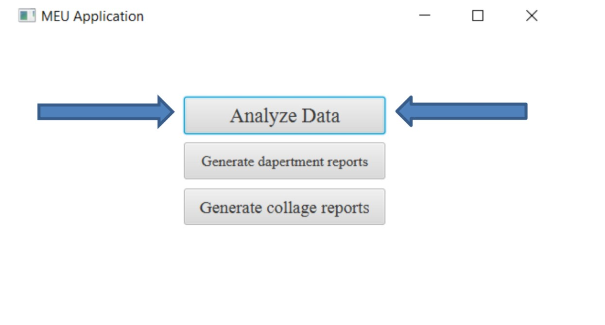 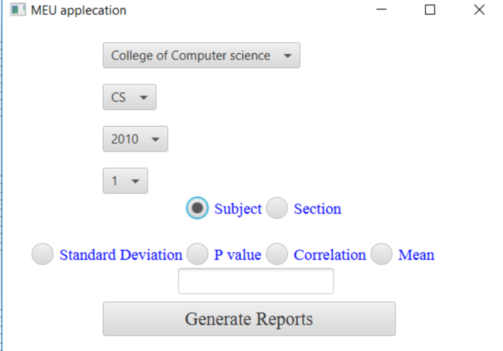

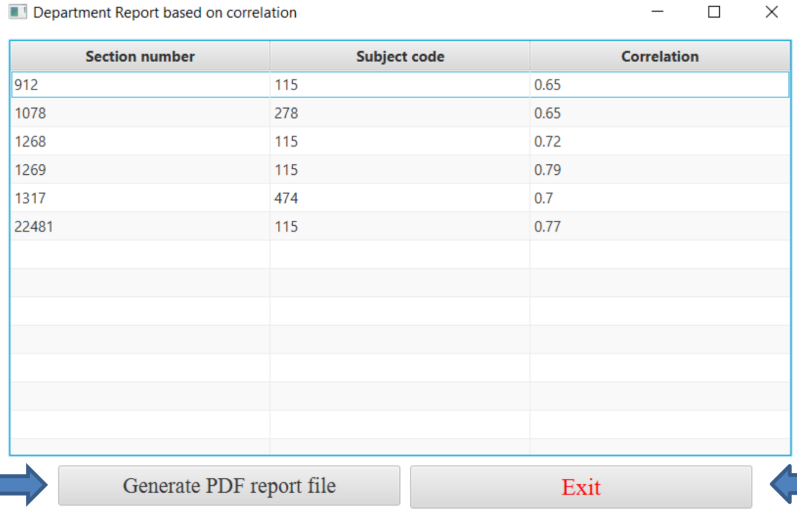 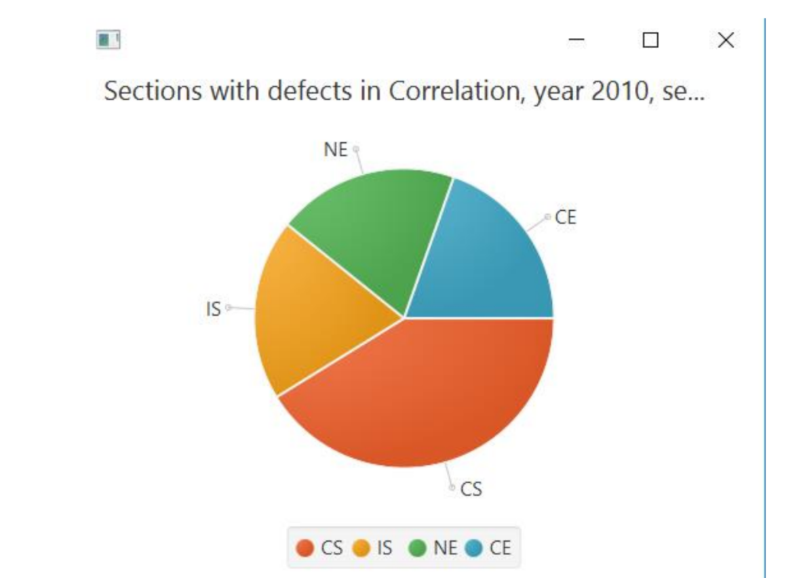

## reports preduced by Java version
### Section report(one section analyzing)
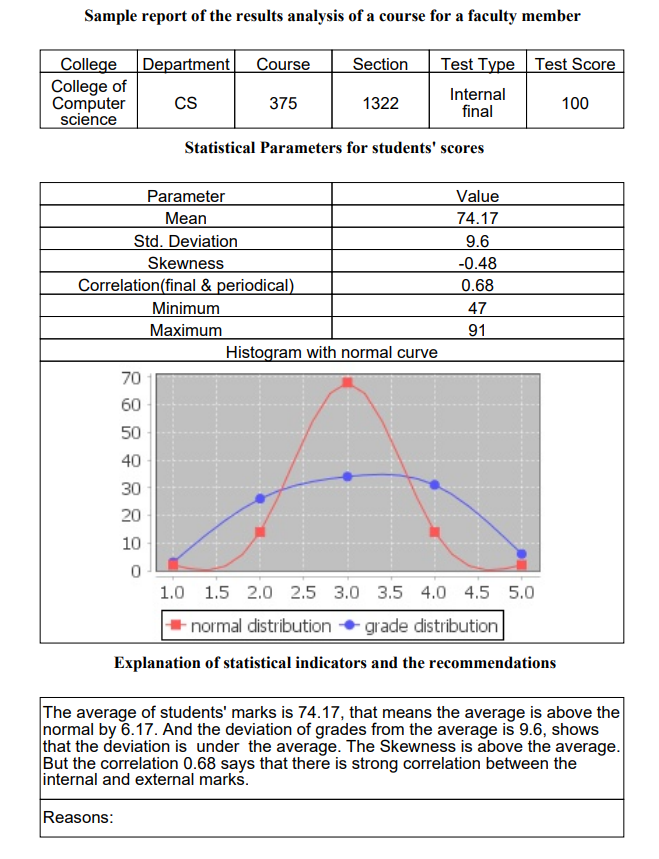
### course report (all section compare)
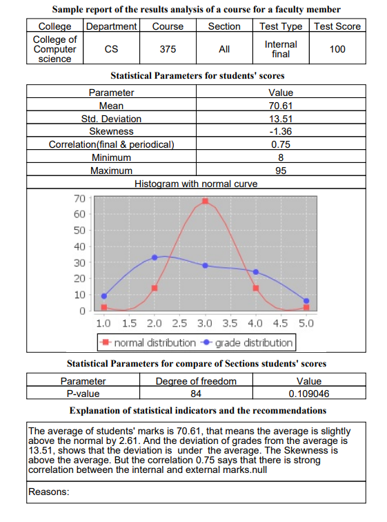

### Python version screenshots
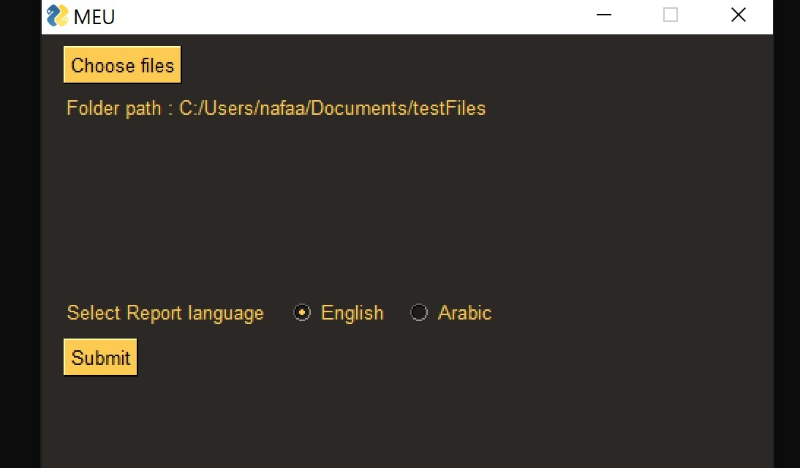

## reports preduced by python version
### Section report(one section analyzing)
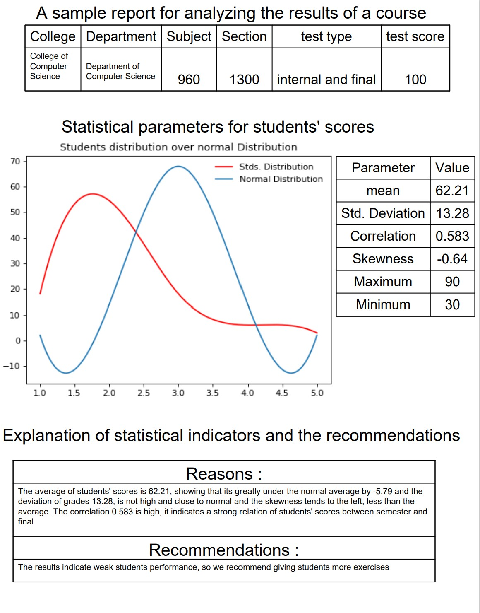
### course report (all section compare)
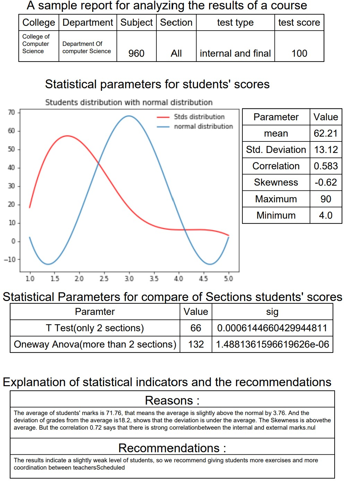

# screenshot from the dashboard im currently working on 
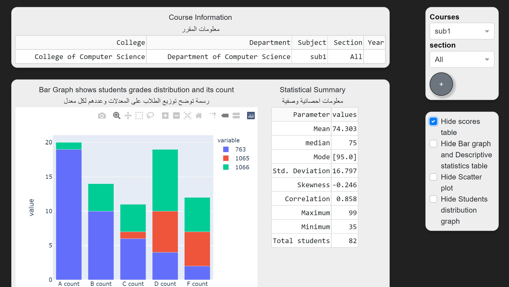
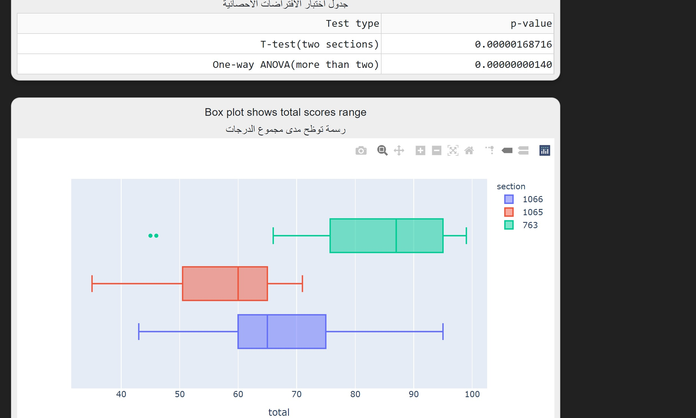
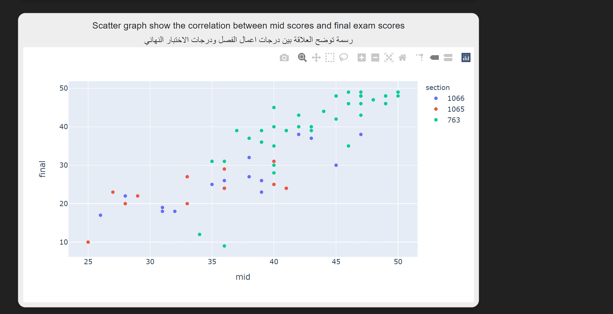

## Project Status
Project is: _in progress_ to make it a web app and provide an interactive dashboard to give better insight for the process of measuring and evaluating.

## Room for Improvement
- Adding interactive dashboard
- Add courses compare future to compare its courses performance either with each other or over period of time.

To do:
- Move the project completely to a web app to reach wider audience.
- Add interactive dashboards
- Integrate sign in/sign up to allow users to creat and analyze there assessments files.

## Acknowledgements
- This project was inspired and supervised by Dr. Talal Qaid.
- Java version was written by [Nafie Alhilaly](https://www.linkedin.com/in/nafie-alhilaly) and [Tarek Barakat](https://www.linkedin.com/in/tarek-barakat-aa211516b/).
- Python version was written by [Nafie Alhilaly](https://www.linkedin.com/in/nafie-alhilaly).

## Contact
Created by [Nafie Alhilaly](https://www.linkedin.com/in/nafie-alhilaly) - feel free to contact me!

